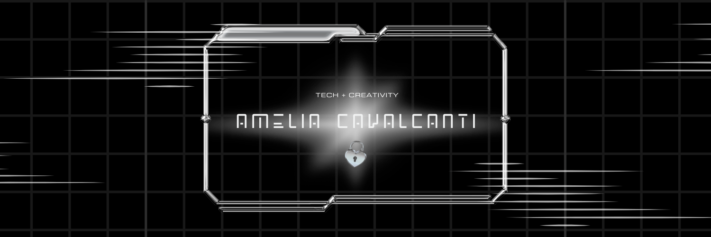

  

# ✦ Amélia Cavalcanti ✦

👩‍💻 Estudante de **Técnico em Informática** no **CEET Giuseppe Altoé**  
⚪ Apaixonada por tecnologia, mas sempre com um olhar criativo e poético sobre o mundo digital.  
Minha essência mistura lógica, arte e propósito — criando projetos que unem **sustentabilidade, impacto social e inovação**.  

---

## ⬢ Skills
◽ **Python** — análise e back-end  
◽ **C#** — exercícios, lógica e aplicações  
◽ **Banco de Dados (SQLite / SQLAlchemy)**  
◽ **JSON & APIs** — integração e comunicação de sistemas  

---

## ⬢ Em desenvolvimento
🛰️ **Eco Sensor** → Projeto que une **sustentabilidade + tecnologia**, com foco em monitoramento ambiental.  
*(em breve no GitHub!)*  

---

## ⬢ Interesses
◽ Desenvolvimento Back-end  
◽ Análise e Visualização de Dados  
◽ Projetos que unem **tecnologia com impacto social**  
◽ Estética digital, escrita e criação de experiências únicas  

---

## ⬢ Repositórios em Destaque
✦ [cadastro-livros](https://github.com/ameliacavalcanti/cadastro-livros) → Exercício prático de cadastro em C#  
✦ [sistema-lanchonete](https://github.com/ameliacavalcanti/sistema-lanchonete) → Sistema simples de lanchonete em C#  
✦ [site-direito](https://github.com/ameliacavalcanti/SiteDireito) → Site informativo em HTML, CSS e JS  
✦ [meu-blog](https://github.com/ameliacavalcanti/meu-blog) → Blog pessoal desenvolvido em HTML e CSS  

---

⚪ Sempre explorando a interseção entre **arte e tecnologia**, buscando aprender e compartilhar conhecimento que inspire.  
